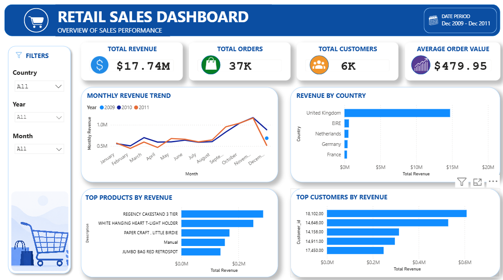
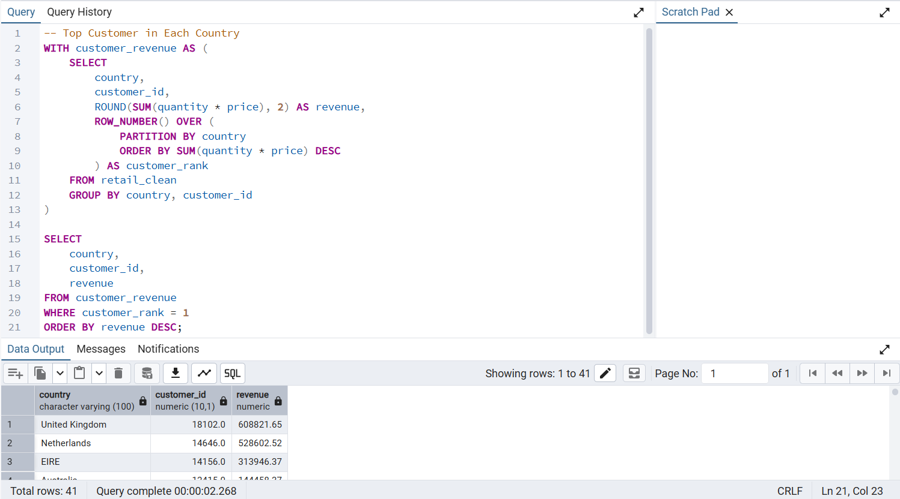

# Retail Sales Analysis

## Project Overview

This project analyzes retail transaction data using PostgreSQL and Power BI. The objective is to uncover sales trends, identify top-performing products and customers, and generate business insights through SQL queries and interactive dashboards.

---

## Business Problem

A retail company wants to better understand its sales performance and customer purchasing behavior. By analyzing historical transaction data, the company aims to:

- Identify top-selling products.
- Determine the highest-value customers.
- Analyze revenue by country.
- Monitor monthly sales trends.
- Support data-driven business decisions.

---

## Dataset

**Dataset:** Online Retail Dataset

The dataset contains retail transactions with the following fields:

- Invoice
- StockCode
- Description
- Quantity
- InvoiceDate
- Price
- Customer_ID
- Country

---

## Tools Used

- PostgreSQL
- pgAdmin 4
- Power BI
- GitHub

---

## Data Cleaning

The dataset was cleaned by:

- Removing records with missing Customer IDs.
- Removing transactions with zero or negative quantities.
- Removing transactions with zero or negative prices.
- Creating a cleaned table (`retail_clean`) for analysis.

---

## SQL Analysis

The project includes SQL queries for:

- Total Revenue
- Total Orders
- Total Customers
- Average Order Value
- Revenue by Country
- Monthly Revenue Trend
- Top Customers
- Top Products
- Customer Analysis
- Product Analysis
- Window Functions
- Common Table Expressions (CTEs)
- Views

---

## Dashboard

The Power BI dashboard includes:

- KPI Cards
- Monthly Revenue Trend
- Revenue by Country
- Top Products
- Top Customers
- Interactive Filters

---

## Project Screenshots

### Dashboard



---

### SQL Example - CTE and Window Function

This query uses a Common Table Expression (CTE) together with a window function to rank customers based on total revenue. It demonstrates advanced SQL techniques for business analysis and customer performance evaluation.



---

## Key Insights

- The highest-value customers generate a significant share of total revenue.
- Revenue is concentrated in a small number of countries.
- Several products consistently outperform others in sales volume.
- Monthly sales fluctuate throughout the year, revealing seasonal patterns.

---

## Business Recommendations

- Focus marketing campaigns on high-value customers.
- Maintain inventory for top-selling products.
- Expand sales strategies in high-performing countries.
- Investigate slow-moving products and optimize inventory levels.
- Use monthly sales trends to improve demand forecasting.

---

## 📁 Project Structure

```
Retail_Sale_Analysis/
│
├── Dataset/
├── SQL/
│   ├── 01_data_cleaning.sql
│   ├── 02_exploratory_analysis.sql
│   ├── 03_customer_analysis.sql
│   ├── 04_product_analysis.sql
│   ├── 05_advanced_analysis.sql
│   └── 06_views.sql
│
├── Dashboard/
│   └── Retail_Sales.pbix
│
├── Images/
│   ├── dashboard.png
│   ├── sql_top_customers.png
│   ├── sql_top_products.png
│   ├── sql_monthly_revenue.png
│   └── sql_cte_window_function.png
│
└── README.md
```

---

## Skills Demonstrated

- SQL
- PostgreSQL
- Data Cleaning
- Exploratory Data Analysis (EDA)
- Data Aggregation
- Window Functions
- Common Table Expressions (CTEs)
- Views
- Business Analysis
- Data Visualization
- Power BI
- Dashboard Design

---

## 👤 Author

**Dwight Baines F. Camposano**

Bachelor of Science in Computer Engineering

Aspiring Data Analyst
